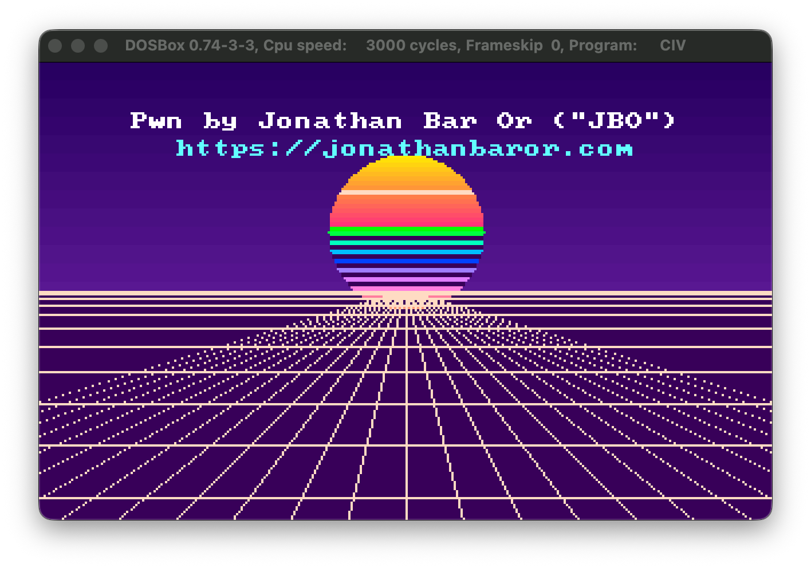

# Sid Meier's Civilization Arbitrary Code Execution
[Sid Meier's Civilization (1991)](https://en.wikipedia.org/wiki/Civilization_(video_game)) is one of my favorite old-timey games.  
It is one of the first strategy games I have ever played, and I literally spent hours designing roads between cities, researching technology, building world wonders and so on.  
As I grew up (mind you, I was but a mere child!) I realized the game's savefiles could be edited, and I have a vivid memory of trying to edit savefiles and having weird consequences.  
After more than 30 years, I've decided to take a day and see if I can get arbitrary code execution in the game, and I'd like to share that with you!

## Initial analysis
My version of the game (which I downloaded from [an amazing old-timey Israeli site](https://old-games.org)) had two executables:

| Filename     | Size          | MD5                              |
| ------------ | ------------- | -------------------------------- |
| CIV.EXE      | 304,512 bytes | 0598509dd378ea71db224e420ac70217 |
| ORIGINAL.EXE | 304,512 bytes | 8c0960a9470c8183fdd88c5810f1f243 |

Both are MS‑DOS MZ executables built with the Microsoft C runtime. They differ in **exactly ten bytes**, all at file offset `0x11D9E`:

```
CIV.EXE      : 8b 1e ca 64  d1 e3  b8 ff 77  89 87 f6 c0  90        9a 6a 02 a7 01
ORIGINAL.EXE : 8b 1e ca 64  d1 e3  8b 86 1c ff  29 87 f6 c0         9a 6a 02 a7 01
```

Disassembled (16‑bit), this is the routine that charges the current player money:

```asm
; ORIGINAL.EXE - the real game: "spend money"
mov  bx, [0x64ca]      ; bx = current player index
shl  bx, 1
mov  ax, [bp-0xe4]     ; ax = amount to pay
sub  [bx-0x3f0a], ax   ; treasury[player] -= amount   ; treasury[] array is at 0xC0F6

; CIV.EXE - patched: treasury is pinned to a constant
mov  bx, [0x64ca]
shl  bx, 1
mov  ax, 0x77ff        ; 0x77FF = 30719
mov  [bx-0x3f0a], ax   ; treasury[player] = 30719
nop
```

So `CIV.EXE` is a **trainer/crack**: instead of deducting money it slams the treasury to 30,719 (the `nop` is a strong hint that this is just patched assembly).  
I conclude that `ORIGINAL.EXE` is the original 1991 binary, and `CIV.EXE` is a binary patched with the money cheat.  
More importantly, the 10-byte patch is nowhere near the save/map loader, so if there is a vulnerability, both binaries would share it.

## Unpacking
Static analysis first hits a wall: the MZ header has **zero relocations** and a tiny entry stub, and the file contains the string `Packed file is corrupt`.
This is a classic fingerprint of [Microsoft EXEPACK](https://moddingwiki.shikadi.net/wiki/Microsoft_EXEPACK).  
The bytes you see in the file are the *compressed* image; disassembly of the raw file is mostly garbage, and offsets don't match what runs.

EXEPACK is a load‑time self‑decompressor: the MZ entry point is a small unpacker stub that inflates the real image into memory and jumps to it.  
Rather than reimplement EXEPACK, the cleanest unpack is to **let the stub do the work under emulation**:
1. Load the file's image into a [Unicorn](https://www.unicorn-engine.org/) 16‑bit real‑mode context at a chosen segment, set `CS:IP/SS:SP` from the MZ header, and a minimal [PSP](https://en.wikipedia.org/wiki/Program_Segment_Prefix).
2. Run it. The EXEPACK stub decompresses the image and relocates it in place, then jumps to the original entry point.
3. Stop at the **first `INT 21h`** (the C runtime's "get DOS version" at startup) - by that point, the whole image is decompressed in memory. We can then easily **dump RAM** at that point.

That dump is a faithful snapshot of the running program: correct code, correct data, correct addresses. Two things are worth noting for later:
* The **data segment (DGROUP)** lands at a fixed paragraph offset from the load base. In the emulation (load base `0x1000`) DGROUP is `0x3A1B`; at runtime it is `load_base + 0x2A1B`.
* *Civilization* uses **DOS overlays** - chunks of code (including the save‑game loader) that are **not** part of the EXEPACK image at all. They live **raw** in ~126 KB appended after the MZ image and are paged-in at runtime. That's why the loader is invisible in the unpacked base image but perfectly readable in the file's tail.

### DGROUP
One more thing I was not familiar with is the concept of `DGROUP`, which will be critical to understanding this exploit.  
In 16-bit x86, a segment register only reaches a 64 KB window.  
`DGROUP` ("data group") is the single segment the C compiler puts all near data in — initialized globals, `BSS`, constants, and (in this game's memory model) the **stack**.  
The runtime sets `DS=DGROUP`, so every global is just `[DS:offset]`.  
Two things matter for us: because `SS=DS= DGROUP`, the buffer, the globals, and the stack all share one segment (so an overflow walks right through them).  
While **offsets** inside `DGROUP` are fixed, the DGROUP **segment value** is `load_base + constant`, so it shifts with the DOS memory layout.  
We will discuss the implications of that during the exploitation section.

## Reverse engineering the map loader
One thing I started doing before reverse-engineering everything, is to refer to [OpenCivOne](https://codeberg.org/rhorvat/OpenCivOne).  
This is a re-implementation of the game based on reverse-engineering, and thus - I found it extremely helpful.

### Save files come in pairs
A saved game is two files: `CIVIL#.SVE` (game state, fixed 37,856 bytes) and `CIVIL#.MAP` (which is the "world map").
Loading a slot loads **both** - and the `.MAP` seems to be loaded *first*.

Interestingly, the file `CIVIL#.MAP` is not raw tiles - rather, it's a **PIC image** (I concluded that from the function [LoadGameData](https://codeberg.org/rhorvat/OpenCivOne/src/branch/master/src/Game/CodeObjects/GameLoadAndSave.cs) in `OpenCivOne`).  
The format is a stream of blocks:

```c
uint16_t signature;
uint16_t length;
uint8_t data[];     // "length" bytes
```

The block types are also taken from `OpenCivOne`:

| Signature | Meaning                                                                                                                                  |
| --------- | ---------------------------------------------------------------------------------------------------------------------------------------- |
| `0x3045`  | 8‑bit palette                                                                                                                            |
| `0x304D`  | 18‑bit palette                                                                                                                           |
| `0x3058`  | image data ([LZW](https://en.wikipedia.org/wiki/Lempel–Ziv–Welch) + [RLE](https://en.wikipedia.org/wiki/Run-length_encoding) compressed) |

A real `CIVIL#.MAP` is a single `0x3058` image block (320×200).

### The vulnerability
The PIC block loop lives in one of the code overlays.  
To analyze it, I used the [DOSBox-X](https://dosbox-x.com) debugger - the runtime addresses might be different in your runs, but the offsets of `0xC926` and `0xE83A` will be load-base-independent.  
Here is the dispatch of the PIC block loop:

```asm
0823:10a8  lodsw                    ; ax = block signature
0823:10ad  cmp   al, 0x58           ; low byte 0x58 == image block (0x3058)?
0823:10af  je    0x112a             ; image handler (LZW/RLE)
0823:10b1  mov   di, ds
0823:10b3  mov   es, di             ; ES = DS = DGROUP
0823:10b5  lea   di, [0xc926]       ; fixed destination buffer, no size known
0823:10b9  cmp   ax, 0x304d
...
0823:10cf  push  di
0823:10d0  stosw                    ; store signature word into the buffer
...
0823:10e9  lodsw                    ; ax = block LENGTH  (straight from the file!)
0823:10ee  stosw                    ; store length word into the buffer
0823:10ef  mov   cx, ax
0823:10f1  shr   cx, 1              ; cx = length/2 words
0823:10f3  jcxz  0x1115
0823:10f5  ...                      ; (buffer-refill plumbing)
0823:1112  stosw                    ; copy loop: file -> ES:DI (0xC926+)
0823:1113  loop  0x10f5             ; repeated length/2 times. NO BOUNDS CHECK.
```

Any block whose signature low byte is **not** `0x58` (e.g. a palette block `0x3045`) is copied as-is into the fixed scratch buffer at `DGROUP:0xC926`, and the number of bytes copied is the block's own 16‑bit `length` field.  
In other words, we have a fully attacker‑controlled wild memory copy, up to 65,535 bytes.

Because this is a small/compact‑model DOS program, the `SS` register and the `DS` register are equal to `DGROUP`: the scratch buffer, the game's globals, *and the stack* all live in the same 64 KB segment.  
So, the overflow runs contiguously from `0xC926` straight up through every global and into the stack.

### A nearby function pointer
After a bit of exploring, I've discovered a function pointer (as a [FAR pointer](https://en.wikipedia.org/wiki/Far_pointer)) at `DGROUP:0xE83A`.  
That function is the parser's **read‑buffer "refill" routine** and invoked as:

```asm
ff 1e 3a e8      lcall [0xe83a]     ; call [0xE83A] (offset) : [0xE83C] (segment)
```

The parser calls this whenever its input buffer runs dry.  
Note that `0xE83A` is `0x1F10` bytes into our block data - comfortably within reach of the overflow.  
If we overwrite it - the *next* refill call transfers control wherever we like.

## Exploitation
The exploitation plan is as follows:
1. Use a **palette block** (`0x3045`) so we hit the copy path (not the LZW/RLE image handler - which, inconveniently, reinitializes a dictionary right over `0xC926`).
2. Put the **shellcode at the very start of the block data**, so it lands at `DGROUP:0xC92A` (immediately after the two words that hold the block's signature and length).
3. Overwrite the refill pointer at block offset `0x1F10` with `DGROUP:0xC92A`.
4. Size the block so the **entire `.MAP` fits in one read‑buffer fill** (a `0x2000`‑byte block). That means **no refill happens during the copy**, so all the globals the parser still needs stay intact while we clobber the pointer.
5. When the parser finishes our block and loops back for the next one, it calls the refill pointer - now aimed at our code.

Layout of the crafted `.MAP`:
```
+0x0000  signature = 0x3045
+0x0002  length    = 0x2000
+0x0004  shellcode ...                       -> copied to DGROUP:0xC92A  (entry point)
   ...   NOP padding if necessary ...
+0x1F10  refill pointer = DGROUP:0xC92A      -> overwrites [0xE83A]
   ...
```

Shellcode runs in **real mode with `CS=SS=DS=DGROUP`, entry `IP=0xC92A`**, with a usable stack and full BIOS/VGA access.

### The segment problem
There is one load‑base‑dependent value: the hijack pointer must name **DGROUP**, and DGROUP = `load_base + 0x2A1B`, which depends on how much conventional memory DOS has consumed before the program loads.  
Different DOS/DOSBox/DOSBox-X configurations load the game at different bases. From my experiments:

| environment | DGROUP   |
| ----------  | -------- |
| DOSBox‑x    | `0x323E` |
| DOSBox      | `0x2BBD` |

The exploit cannot be made fully position‑independent from static data, as the game's own live code segment sits a fixed `0xA67` paragraphs *below* DGROUP, but the `0xC926` buffer is roughly `0x17000` bytes *above* that code segment - out of range of a 16‑bit offset, and thus we can't borrow the game's runtime segment to reach our payload. The segment must be supplied.

I thus built a utility called [SEGFIND.COM](SEGFIND.COM) (sourced as [segfind.asm](segfind.asm)) that measures it.
You are supposed to run it the same way you launch the game - it reports `DGROUP=PSP+0x2A2B`.  
The calculation for those who are interested:
1. The `PSP` is the program segment prefix DOS hands the first child.
2. We add `0x10` to the image base.
3. We add `0x2A1B` to the image base to get DGROUP.

You can feed that number to my exploit implementation using the `--dgroup` commandline option.

### Full exploit
My full exploit lives in this repository as [civ1_map_exploit.py](civ1_map_exploit.py) - it creates a trojanized `CIVIL#.MAP` file which can be loaded.  
For fun, I've created a "retrowave" demo, like the good old days, which you can find under [demo.asm](demo.asm).  
Here is how it looks like (this is a link to YouTube):

[](https://www.youtube.com/watch?v=o3X37lpCJOo)

The demo itself looks like this:  


## Build and run

### Prerequisites
* [nasm](https://www.nasm.us) (assembler)
* `python3`
* DOSBox or dosbox‑x, plus the game files (`ORIGINAL.EXE`/`CIV.EXE`, and a valid `CIVIL#.SVE` for the slot you'll load).

### Assemble the payload
```sh
nasm -f bin demo.asm -o demo.bin
```

### Assemble the segment finder
```sh
nasm -f bin segfind.asm -o SEGFIND.COM
```

### Find your DGROUP (probably skip if you're on DOSBox)
Copy `SEGFIND.COM` next to the game, launch DOSBox as you normally do, and at the same prompt you'd start the game from, run:
```
SEGFIND.COM
```
Note the printed `DGROUP = 0xXXXX`.

### Build the malicious map
```sh
# DOSBox (default segment 0x2BBD):
python3 civ1_map_exploit.py demo.bin CIVIL0.MAP

# Any other config, using SEGFIND's value:
python3 civ1_map_exploit.py demo.bin CIVIL0.MAP --dgroup 0xXXXX
```

`civ1_map_exploit.py` also accepts raw shellcode inline: `--hex 'b8 13 00 cd 10 ...'`.

### Fire it
Put the crafted `CIVIL0.MAP` next to a **valid** `CIVIL0.SVE`, start the game, and **load slot 0** (that's the first saved game).  

## Summary
This was a very fun weekend project for me, similar to what I've previously done with [Dangerous Dave](https://github.com/yo-yo-yo-jbo/dangerous_dave).  
I might start working more seriously as a hobby on modding or hacking old DOS games, these are way more fun for me these days since a lot of things are propriatery.

Stay tuned!

Jonathan Bar Or
